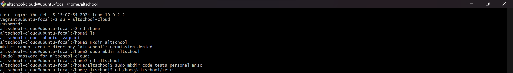
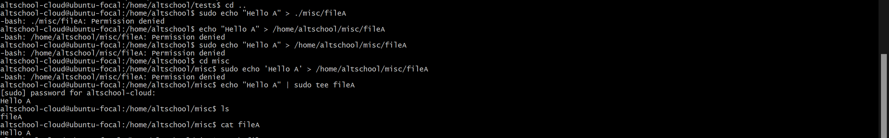
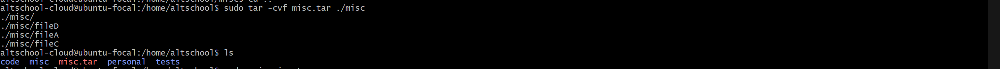
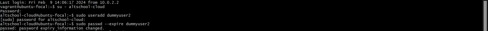
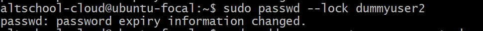
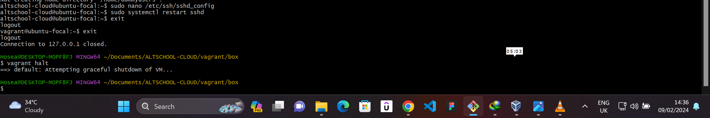
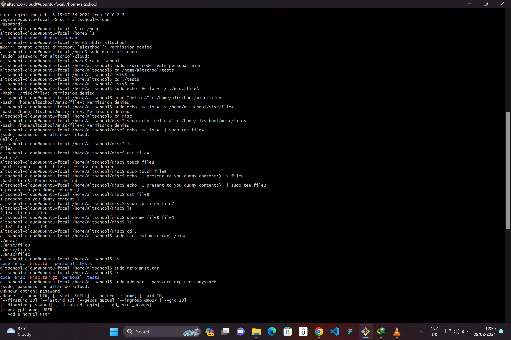
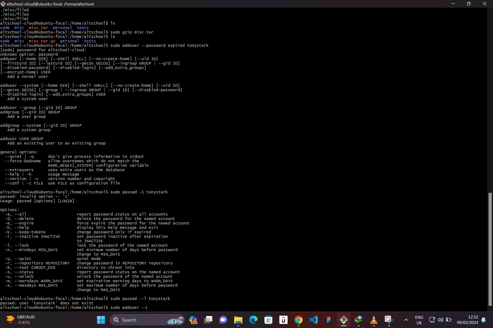
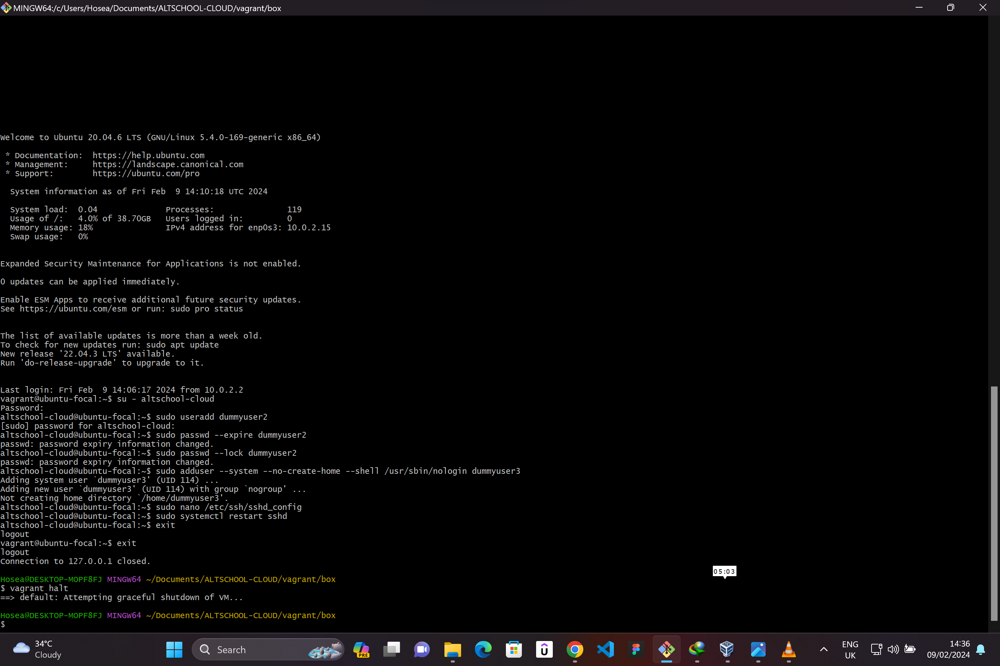
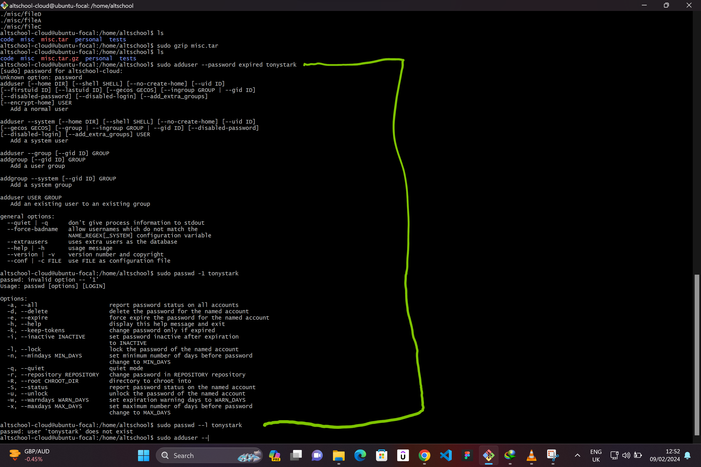

# LINUX FUNDAMENTALS

## PROBLEM
Your login name: altschool i.e., home directory /home/altschool. The home directory contains the following sub-directories: code, tests, personal, misc Unless otherwise specified, you are running commands from the home directory.

a.Change directory to the tests directory using absolute pathname

b.Change directory to the tests directory using relative pathname

c.Use echo command to create a file named fileA with text content ‘Hello A’ in the misc directory

d.Create an empty file named fileB in the misc directory. Populate the file with a dummy content afterwards

e.Copy contents of fileA into fileC

f.Move contents of fileB into fileD

g.Create a tar archive called misc.tar for the contents of misc directory

h.Compress the tar archive to create a misc.tar.gz file

I. Create a user and force the user to change his/her password upon login

J. Lock a users password

K. Create a user with no login shell

L. Disable password based authentication for ssh

M. Disable root login for ssh

Mode of submission:

you are going to push the required commands to your github repositories.

Deadline: 10th Feb 2024

## SOLUTION

1. `Change directory to the tests directory using absolute pathname`  
    "cd /home/altschool/tests"
    

2. `Change directory to the tests directory using relative pathname`  
    "cd ./tests"
    

3. `Use echo command to create a file named fileA with text content Hello A in the misc directory`  
    "echo "Hello A" | sudo tee fileA"
    

4. `Create an empty file named fileB in the misc directory. Populate the file with a dummy content afterwards`  
    "sudo touch fileB"
    "echo "I present to you dummy content" | sudo tee fileB"
    

5. `Copy contents of fileA into fileC`  
    "sudo cp fileA fileC"
    

6. `Move contents of fileB into fileD`  
    "sudo mv fileB fileD"
    

7. `Create a tar archive called misc.tar for the contents of misc directory`  
    "sudo tar -cvf misc.tar ./misc"
    

8. `Compress the tar archive to create a misc.tar.gz file`  
    "sudo gzip misc.tar"
    

9. `Create a user and force the user to change his/her password upon login`  
    "sudo useradd dummyuser2"
    "sudo passwd --expire dummyuser2"
    

10. `Lock a users password`  
    "sudo passwd --lock dummyuser2"
    

11. `Create a user with no login shell`  
    "sudo adduser --system --no-create-home --shell /usr/bin/nologin dummyuser3"
    

12. `Disable password based authentication for ssh`  
    "sudo nano /etc/ssh/sshd_config"
    "sudo systemctl restart sshd"
    

13. `Disable root login for ssh`  
    "sudo nano /etc/ssh/sshd_config"
    "sudo systemctl restart sshd"
    

## FULLSCREEN
    

## ERROR
While testing a few commands for `problem 8` i ran into an error that made my virtual machine unresponsive. I had to exit my terminal and shutdown virtual machine from the virtual box. Attached below is the error screen and the restart screen.

  